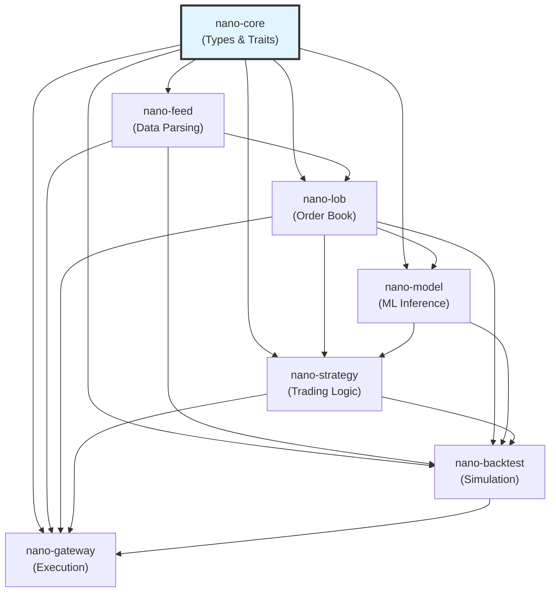

## Overview

NanoARB is organized as a Cargo workspace with 7 crates, each responsible for a distinct layer of the trading system. This modular design enables:

- **Independent development** - Crates can be tested and benchmarked in isolation
- **Clear dependencies** - One-way dependency graph prevents circular references
- **Reusability** - Core types and traits shared across all crates
- **Fast compilation** - Changes to one crate don't require rebuilding unrelated code

## Dependency Graph



**Dependency rule**: All crates depend on `nano-core`, and dependencies only flow downward in the stack.

---

## nano-core

**Location**: `crates/nano-core/`

**Description**: Foundation crate providing domain types, traits, constants, and error handling for the entire system.

### Key Types

#### Price (`types/price.rs:1`)

Fixed-point decimal representation to avoid floating-point errors:

```rust
#[derive(Copy, Clone, Debug, PartialEq, Eq, PartialOrd, Ord)]
pub struct Price {
    raw: i64,  // In minimum price increments (ticks)
}

impl Price {
    pub fn from_ticks(ticks: i64, tick_size: u32) -> Self;
    pub fn as_f64(&self, tick_size: f64) -> f64;
}
```

**Usage**: `Price::from_ticks(50000, 25)` represents $5000.00 with 0.25 tick size.

#### Quantity (`types/quantity.rs:1`)

```rust
#[derive(Copy, Clone, Debug, PartialEq, Eq, PartialOrd, Ord)]
pub struct Quantity(u32);
```

#### Side (`types/side.rs:1`)

```rust
#[derive(Copy, Clone, Debug, PartialEq, Eq)]
pub enum Side {
    Buy,
    Sell,
}
```

#### Timestamp (`types/timestamp.rs:1`)

Nanosecond-precision timestamp:

```rust
#[derive(Copy, Clone, Debug, PartialEq, Eq, PartialOrd, Ord)]
pub struct Timestamp(u64);  // Nanoseconds since epoch

impl Timestamp {
    pub fn now() -> Self;
    pub fn from_nanos(nanos: u64) -> Self;
    pub fn as_nanos(&self) -> u64;
}
```

#### Order (`types/order.rs:1`)

```rust
pub struct Order {
    pub id: OrderId,
    pub instrument_id: u32,
    pub side: Side,
    pub price: Price,
    pub quantity: Quantity,
    pub timestamp: Timestamp,
    pub order_type: OrderType,
}
```

### Core Traits

Defines interfaces for all major system components (see `traits.rs:1`):

#### Strategy (`traits.rs:48`)

```rust
pub trait Strategy: Send + Sync {
    fn name(&self) -> &str;
    fn on_market_data(&mut self, book: &dyn OrderBook) -> Vec<Order>;
    fn on_fill(&mut self, fill: &Fill);
    fn on_order_ack(&mut self, order_id: OrderId);
    fn position(&self) -> i64;
    fn pnl(&self) -> f64;
}
```

#### OrderBook (`traits.rs:6`)

```rust
pub trait OrderBook: Send + Sync {
    fn best_bid(&self) -> Option<(Price, Quantity)>;
    fn best_ask(&self) -> Option<(Price, Quantity)>;
    fn mid_price(&self) -> Option<Price>;
    fn spread(&self) -> Option<Price>;
}
```

#### ModelInference (`traits.rs:160`)

```rust
pub trait ModelInference: Send + Sync {
    type Input;
    type Output;
    fn predict(&self, input: &Self::Input) -> Result<Self::Output>;
    fn expected_latency_ns(&self) -> u64;
}
```

### Dependencies

- `rust_decimal` - Decimal arithmetic
- `serde` / `bincode` / `rkyv` - Serialization
- `chrono` - Time handling
- `thiserror` - Error types

**No runtime dependencies on other NanoARB crates**.

---

## nano-feed

**Location**: `crates/nano-feed/`

**Description**: CME MDP 3.0 binary protocol parser and synthetic data generator.

### Features

- **SBE Decoder** - Parses Simple Binary Encoding messages from CME
- **Zero-copy parsing** - Uses `nom` combinator library for allocation-free parsing
- **Message types** - Book updates, trades, channel resets, security status
- **Synthetic generator** - Creates realistic market data for development and testing

### Key Modules

#### MdpParser (`parser.rs:1`)

Parses raw CME MDP 3.0 packets:

```rust
pub struct MdpParser {
    // Internal state for incremental parsing
}

impl MdpParser {
    pub fn new() -> Self;
    pub fn parse(&mut self, data: &[u8]) -> Result<MdpMessage>;
}
```

**Supported message types** (see `messages.rs:1`):
- `MDIncrementalRefreshBook` (Template 46) - Order book updates
- `MDIncrementalRefreshTrade` (Template 42) - Executed trades
- `ChannelReset` (Template 4) - Channel state reset
- `SecurityStatus` (Template 30) - Trading status changes

#### Synthetic Data Generator (`synthetic.rs:1`)

Generates realistic market microstructure:

```rust
pub struct SyntheticFeedGenerator {
    pub base_price: f64,
    pub volatility: f64,
    pub spread_bps: f64,
    pub tick_rate_hz: f64,
}

impl SyntheticFeedGenerator {
    pub fn generate_tick(&mut self, timestamp: Timestamp) -> BookUpdate;
}
```

**Generation model**:
- Geometric Brownian Motion for price drift
- Poisson arrivals for order events
- Realistic bid/ask spread and depth
- Correlated buy/sell pressure

### Dependencies

- `nano-core` - Core types
- `nom` - Parser combinators
- `bytes` - Byte manipulation
- `rand` / `rand_distr` - Random number generation

---

## nano-lob

**Location**: `crates/nano-lob/`

**Description**: High-performance limit order book with 20-level depth and HFT feature extraction.

### Key Modules

#### OrderBook (`orderbook.rs:1`)

```rust
pub struct OrderBook {
    instrument_id: u32,
    bids: BTreeMap<Price, Quantity>,
    asks: BTreeMap<Price, Quantity>,
    timestamp: Timestamp,
}

impl OrderBook {
    pub fn new(instrument_id: u32) -> Self;
    pub fn apply_update(&mut self, update: &BookUpdate);
    pub fn best_bid(&self) -> Option<(Price, Quantity)>;
    pub fn best_ask(&self) -> Option<(Price, Quantity)>;
    pub fn mid_price(&self) -> Option<Price>;
}
```

**Performance** (see benchmarks in `benches/orderbook.rs`):
- Update operation: **45ns median** (P95: 62ns)
- BBO query: **5ns** (read-only, no allocation)
- 20-level iteration: **180ns**

#### LobFeatureExtractor (`features.rs:1`)

Extracts HFT features for ML models:

```rust
pub struct LobFeatureExtractor;

impl LobFeatureExtractor {
    pub fn microprice(book: &OrderBook) -> f64;
    pub fn order_flow_imbalance(book: &OrderBook) -> f64;
    pub fn vpin(snapshots: &[LobSnapshot]) -> f64;
    pub fn book_imbalance(book: &OrderBook, levels: usize) -> f64;
    pub fn extract_all(book: &OrderBook) -> Array1<f64>;
}
```

**Feature definitions**:

1. **Microprice** - Volume-weighted mid:
   ```
   μ = (P_bid * Q_ask + P_ask * Q_bid) / (Q_bid + Q_ask)
   ```

2. **Order Flow Imbalance (OFI)**:
   ```
   OFI = Δ(Q_bid) - Δ(Q_ask)
   ```

3. **VPIN** - Volume-Synchronized Probability of Informed Trading:
   ```
   VPIN = |V_buy - V_sell| / V_total
   ```

4. **Book Imbalance**:
   ```
   BI = (Q_bid - Q_ask) / (Q_bid + Q_ask)
   ```

#### SnapshotRingBuffer (`snapshot.rs:1`)

Fixed-size circular buffer for LOB history:

```rust
pub struct SnapshotRingBuffer {
    snapshots: Vec<LobSnapshot>,
    capacity: usize,
    cursor: usize,
}

impl SnapshotRingBuffer {
    pub fn new(capacity: usize) -> Self;
    pub fn push(&mut self, snapshot: LobSnapshot);
    pub fn as_tensor(&self) -> Array2<f64>;  // (seq_len, features)
}
```

**Usage**: Maintain 100-snapshot history for ML model input.

### Dependencies

- `nano-core` - Core types and traits
- `nano-feed` - Market data messages
- `ndarray` - Tensor operations
- `smallvec` - Stack-allocated vectors
- `parking_lot` - Fast mutexes

---

## nano-model

**Location**: `crates/nano-model/`

**Description**: ONNX-based ML model inference for trading signals.

### Features

- **ONNX Runtime** - Cross-platform inference engine
- **Model types** - Mamba, Transformer, Decision Transformer, IQL
- **Batched inference** - Process multiple instruments simultaneously
- **Latency tracking** - Built-in performance monitoring

### Key Types

#### SignalModel

```rust
pub struct SignalModel {
    // session: ort::Session,  // Commented due to ONNX version compatibility
    input_shape: Vec<usize>,
    output_shape: Vec<usize>,
}

impl ModelInference for SignalModel {
    type Input = Array2<f64>;  // (seq_len, features)
    type Output = Array2<f64>; // (horizons, classes)
    
    fn predict(&self, input: &Self::Input) -> Result<Self::Output> {
        // ONNX inference
    }
}
```

**Model architectures**:

1. **Mamba-LOB** - State Space Model (see README.md:295)
   - Input: (batch, seq=100, features=40)
   - Hidden: 128 dimensions, 4 Mamba blocks
   - Output: (batch, horizons=3, classes=3)
   - Parameters: ~500K
   - Inference: &lt;800ns

2. **Decision Transformer** - Offline RL
   - Predicts optimal actions given past trajectory
   - Context window: 20 timesteps

3. **IQL** - Implicit Q-Learning
   - Value-based RL with expectile regression
   - Used for market-making policy

### Training

Models are trained in Python (see `python/training/`) and exported to ONNX:

```python
import torch.onnx

model = MambaLOB(d_model=128, n_layers=4)
torch.onnx.export(model, dummy_input, "mamba.onnx")
```

Trained models stored in `models/` directory.

### Dependencies

- `nano-core` - Core types
- `nano-lob` - Feature extraction
- `ndarray` - Tensor operations
- `ort` (optional) - ONNX Runtime

---

## nano-strategy

**Location**: `crates/nano-strategy/`

**Description**: Trading strategy implementations and RL environment.

### Key Modules

#### MarketMakerStrategy (`market_maker.rs:1`)

Classic market-making with ML signals:

```rust
pub struct MarketMakerStrategy {
    config: MarketMakerConfig,
    position: i64,
    realized_pnl: f64,
    inventory_skew: f64,
}

impl MarketMakerStrategy {
    pub fn new(name: &str, instrument_id: u32, config: MarketMakerConfig) -> Self;
}

impl Strategy for MarketMakerStrategy {
    fn on_market_data(&mut self, book: &dyn OrderBook) -> Vec<Order> {
        let mid = book.mid_price();
        let spread = self.calculate_spread(book);
        let skew = self.inventory_skew * self.position as f64;
        
        vec![
            Order::limit(Side::Buy, mid - spread/2 - skew, qty),
            Order::limit(Side::Sell, mid + spread/2 - skew, qty),
        ]
    }
}
```

**Configuration** (`market_maker.rs:15`):

```rust
pub struct MarketMakerConfig {
    pub base_spread_ticks: u32,      // Minimum spread (default: 2 ticks)
    pub max_inventory: i64,          // Position limit
    pub order_size: u32,             // Contracts per side
    pub skew_factor: f64,            // Inventory penalty (0.0-1.0)
    pub use_ml_signal: bool,         // Enable ML-based adjustment
}
```

#### RL Environment (`rl_env.rs:1`)

Gym-style interface for reinforcement learning:

```rust
pub struct MarketMakingEnv {
    book: OrderBook,
    position: i64,
    cash: f64,
    timestep: usize,
}

impl MarketMakingEnv {
    pub fn step(&mut self, action: Action) -> (State, f64, bool);
    pub fn reset(&mut self) -> State;
    pub fn render(&self);
}
```

**Action space**:
- Bid offset: \{-5, -4, ..., 0, ..., +4, +5\} ticks
- Ask offset: \{-5, -4, ..., 0, ..., +4, +5\} ticks
- Total: 11 × 11 = 121 discrete actions

**Reward function**:
```
r_t = ΔP&L - λ₁ * |position| - λ₂ * spread
```

#### Signal Strategies (`signals.rs:1`)

ML-driven directional trading:

```rust
pub struct SignalStrategy {
    model: Box<dyn ModelInference>,
    position_sizer: PositionSizer,
}

impl Strategy for SignalStrategy {
    fn on_market_data(&mut self, book: &dyn OrderBook) -> Vec<Order> {
        let features = LobFeatureExtractor::extract_all(book);
        let prediction = self.model.predict(&features)?;
        
        if prediction.confidence > 0.7 {
            vec![Order::market(prediction.side, self.position_sizer.size())]
        } else {
            vec![]
        }
    }
}
```

### Dependencies

- `nano-core` - Strategy trait
- `nano-lob` - Order book access
- `nano-model` - ML inference
- `rand` - Action sampling

---

## nano-backtest

**Location**: `crates/nano-backtest/`

**Description**: Event-driven backtesting engine with realistic latency and fill simulation.

### Architecture

See detailed explanation in [Architecture Overview](/architecture/overview#event-processing-model).

### Key Modules

#### BacktestEngine (`engine.rs:33`)

Core simulation loop:

```rust
pub struct BacktestEngine {
    config: BacktestConfig,
    event_queue: EventQueue,
    exchange: SimulatedExchange,
    latency: LatencySimulator,
    positions: PositionTracker,
    risk: RiskManager,
    metrics: BacktestMetrics,
}

impl BacktestEngine {
    pub fn run<S: Strategy>(&mut self, strategy: &mut S);
    pub fn results(&self) -> BacktestResults;
}
```

#### EventQueue (`events.rs:186`)

Priority queue implementation:

```rust
pub struct EventQueue {
    heap: BinaryHeap<Event>,
    sequence_counter: u64,
}
```

**Event types** (`events.rs:10`):
- `MarketData` - Book update received
- `OrderSubmit` - Order sent to exchange
- `OrderAck` - Order acknowledged
- `OrderFill` - Order executed
- `OrderCancel` - Cancellation confirmed

#### LatencySimulator (`latency.rs:1`)

Models network and processing delays:

```rust
pub struct LatencySimulator {
    order_latency_ns: u64,
    market_data_latency_ns: u64,
    jitter_ns: u64,
}

impl LatencyModel for LatencySimulator {
    fn order_latency(&self) -> i64 {
        self.order_latency_ns + rand::gen_range(0..self.jitter_ns)
    }
}
```

#### SimulatedExchange (`execution.rs:1`)

Fill simulation with queue position model:

```rust
pub struct SimulatedExchange {
    active_orders: HashMap<OrderId, Order>,
    fill_model: QueuePositionModel,
}

impl SimulatedExchange {
    pub fn match_orders(&mut self, book: &OrderBook) -> Vec<Fill>;
}
```

**Fill logic**:
- Limit orders matched only if price crosses
- Queue position estimated from book depth
- Fill probability: `P = min(1, volume_traded / queue_position)`
- Adverse selection: Market orders get worse average price

#### PositionTracker (`position.rs:1`)

Tracks inventory and P&L:

```rust
pub struct PositionTracker {
    positions: HashMap<u32, i64>,
    avg_entry_prices: HashMap<u32, f64>,
    realized_pnl: f64,
}

impl PositionTracker {
    pub fn apply_fill(&mut self, instrument_id: u32, fill: &Fill);
    pub fn total_pnl(&self, current_prices: &HashMap<u32, Price>) -> f64;
}
```

#### RiskManager (`risk.rs:1`)

Enforces trading limits:

```rust
pub struct RiskManager {
    config: RiskConfig,
    peak_pnl: f64,
    daily_pnl_start: f64,
}

impl RiskManager {
    pub fn check_order(&self, order: &Order, position: i64) -> Result<()>;
    pub fn check_position(&self, position: i64) -> Result<()>;
    pub fn should_kill_switch(&self, pnl: f64) -> bool;
}
```

### Dependencies

- `nano-core` - Types and traits
- `nano-feed` - Market data
- `nano-lob` - Order books
- `nano-model` - ML models
- `statrs` - Statistical functions
- `rand` - Random number generation

---

## nano-gateway

**Location**: `crates/nano-gateway/`

**Description**: System entry point with REST API, metrics export, and configuration management.

### Features

- **Axum web server** - REST API for backtests and state queries
- **Server-Sent Events** - Real-time streaming to web UI
- **Prometheus metrics** - Time-series monitoring
- **Configuration** - TOML-based system config

### API Endpoints

Served at http://localhost:9090:

| Endpoint | Method | Description |
|----------|--------|-------------|
| `/health` | GET | Health check |
| `/metrics` | GET | Prometheus metrics |
| `/api/state` | GET | Full engine state (JSON) |
| `/api/stream` | GET | SSE event stream |
| `/api/backtest` | POST | Run backtest |

See [Gateway API documentation](/gateway/api-reference) for details.

### Binary Target

**`nanoarb`** (`src/main.rs`)

Main executable:

```bash
# Run with default config
cargo run --release

# Run backtest
cargo run --release -- --backtest

# Custom config
cargo run --release -- --config custom.toml
```

### Dependencies

- All NanoARB crates
- `axum` - Web framework
- `tokio` - Async runtime
- `prometheus-client` - Metrics
- `clap` - CLI argument parsing
- `config` / `toml` - Configuration

---

## Build Configuration

The workspace `Cargo.toml` defines shared dependencies:

```toml
[workspace]
members = [
    "crates/nano-core",
    "crates/nano-feed",
    "crates/nano-lob",
    "crates/nano-model",
    "crates/nano-strategy",
    "crates/nano-backtest",
    "crates/nano-gateway",
]

[workspace.dependencies]
thiserror = "2.0"
anyhow = "1.0"
serde = { version = "1.0", features = ["derive"] }
tokio = { version = "1.41", features = ["full"] }
# ... more dependencies
```

### Compilation Profiles

```toml
[profile.release]
opt-level = 3
lto = "thin"
codegen-units = 1

[profile.bench]
inherits = "release"
```

## Testing Strategy

Each crate includes:

- **Unit tests** - `#[cfg(test)]` modules in source files
- **Integration tests** - `tests/` directory
- **Benchmarks** - `benches/` with Criterion.rs
- **Property tests** - `proptest` for randomized testing

```bash
# Run all tests
cargo test --workspace

# Run benchmarks
cargo bench --workspace

# Run tests for specific crate
cargo test -p nano-lob
```

## Next Steps

- [Data Flow](/architecture/data-flow) - Trace a tick through the system
- [Strategy Development](/strategies/overview) - Build custom strategies
- [Backtesting Guide](/backtesting/configuration) - Configure simulations
