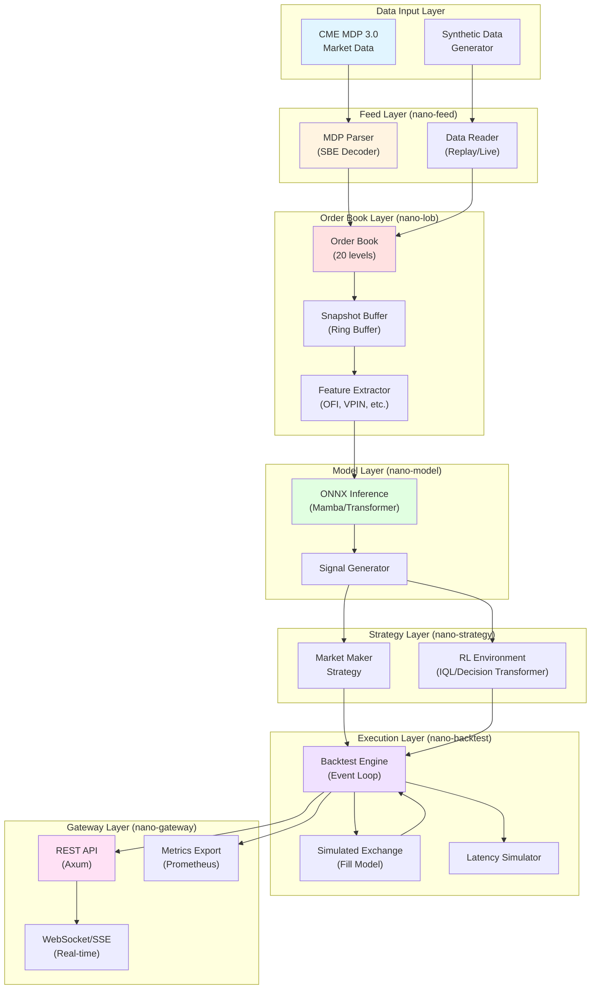

## Introduction

NanoARB is a nanosecond-level high-frequency trading framework built in Rust for CME futures markets (ES, NQ). It achieves sub-microsecond inference latency through an event-driven architecture that combines ultra-low-latency systems programming with cutting-edge machine learning models.

## Core Design Principles

### Event-Driven Architecture

NanoARB uses a strict event-driven model where all system operations are triggered by timestamped events processed through a priority queue. This design ensures:

- **Deterministic execution** - Events are processed in chronological order
- **Realistic backtesting** - Lookahead bias is eliminated by enforcing causality
- **Latency modeling** - Network and processing delays are explicitly simulated
- **Parallel execution** - Multiple strategies can run independently

The event loop is managed by a `BinaryHeap`-based priority queue (see `nano-backtest/src/events.rs:186`) that guarantees O(log n) insertion and O(1) peek operations.

### Zero-Copy Data Processing

To minimize latency, NanoARB employs zero-copy techniques throughout the stack:

- **CME MDP 3.0 parsing** - Direct binary message parsing with `nom` combinator library
- **Order book updates** - In-place modification of `BTreeMap` data structures
- **Serialization** - `rkyv` for zero-copy deserialization of archived data

### Type Safety & Performance

All core types are strongly typed with compile-time guarantees:

- `Price` - Fixed-point decimal to avoid floating-point errors
- `Quantity` - Unsigned integer with overflow checks
- `Timestamp` - Nanosecond-precision u64
- `OrderId` - Unique identifier with non-zero guarantee

See `nano-core/src/types/` for implementations.

## System Architecture



## Component Interaction

### Data Flow (Market Data → Strategy)

1. **Market Data Ingestion**
   - CME MDP 3.0 binary packets arrive via multicast UDP
   - `MdpParser` (nano-feed) decodes SBE-encoded messages
   - Messages are validated and converted to internal types

2. **Order Book Update**
   - `OrderBook` (nano-lob) applies incremental updates
   - 20-level bid/ask depth maintained in `BTreeMap`
   - Book snapshot added to `SnapshotRingBuffer` for ML inference

3. **Feature Extraction**
   - `LobFeatureExtractor` computes:
     - **Microprice** - Volume-weighted mid price
     - **OFI** - Order Flow Imbalance
     - **VPIN** - Volume-Synchronized Probability of Informed Trading
     - **Book Imbalance** - Bid/ask volume asymmetry
   - Features serialized to `ndarray` tensor

4. **ML Inference**
   - ONNX model processes feature tensor (batch=1, seq_len=100, features=40)
   - Mamba model returns directional predictions (up/flat/down) for multiple horizons
   - Inference completes in &lt;800ns (see README.md:228)

5. **Strategy Decision**
   - `MarketMakerStrategy` combines ML signal with inventory skew
   - Generates `Order` objects with price/quantity/side
   - Orders validated by `RiskManager`

### Execution Flow (Strategy → Market)

1. **Order Submission**
   - Strategy returns `Vec<Order>` from `on_market_data()`
   - `BacktestEngine` schedules `OrderSubmit` event with latency
   - Latency determined by `LatencySimulator` (default: 100μs)

2. **Exchange Matching**
   - `SimulatedExchange` attempts to match orders against current book
   - Fill probability based on queue position model
   - Partial fills supported for large orders

3. **Fill Notification**
   - `OrderFill` event scheduled with notification latency
   - Strategy receives `on_fill()` callback
   - `PositionTracker` updates inventory and realized P&L

4. **Risk Monitoring**
   - `RiskManager` checks position limits, drawdown, daily loss
   - Kill switch triggered if breach detected
   - Engine transitions to `EngineState::Stopped`

## Event Processing Model

The `BacktestEngine` (nano-backtest/src/engine.rs:33) processes events in a deterministic loop:

```rust
while !event_queue.is_empty() {
    let event = event_queue.pop();
    match event.event_type {
        EventType::MarketData { instrument_id } => {
            // Update order book, call strategy, schedule orders
        }
        EventType::OrderSubmit { order } => {
            // Submit to exchange, schedule ack
        }
        EventType::OrderFill { fill } => {
            // Update positions, notify strategy
        }
        // ... other event types
    }
}
```

Events are ordered by:
1. **Timestamp** (primary) - Earlier events processed first
2. **Sequence number** (tiebreaker) - Preserves submission order

See `nano-backtest/src/events.rs:176` for ordering implementation.

## Latency Budget

From README.md (lines 221-228), the latency budget for tick-to-trade:

| Operation | Median | P95 | P99 |
|-----------|--------|-----|-----|
| LOB Update | 45ns | 62ns | 78ns |
| Feature Extraction | 120ns | 145ns | 168ns |
| Model Inference | 580ns | 720ns | 890ns |
| Signal Generation | 35ns | - | - |
| **Total** | **780ns** | **950ns** | **1.2μs** |

This sub-microsecond latency is achieved through:
- Rust's zero-cost abstractions
- SIMD-optimized numerical operations
- Lock-free data structures where possible
- ONNX Runtime with CPU-specific optimizations

## Concurrency Model

### Backtesting (Single-threaded)

Backtests run single-threaded for determinism:
- All events processed sequentially
- No race conditions or non-deterministic behavior
- Reproducible results with same seed

### Live Trading (Multi-threaded)

In live mode (nano-gateway), concurrency is managed via:
- **Market data thread** - Receives UDP packets, updates order book
- **Strategy thread** - Processes book snapshots, generates signals
- **Execution thread** - Submits orders to FIX gateway
- **Metrics thread** - Exports Prometheus metrics

Communication via `crossbeam-channel` MPSC queues for low-latency message passing.

## Configuration & Deployment

The system is configured via TOML files (see README.md:265):

```toml
[trading]
live_enabled = false
symbols = ["ESH24"]
max_position = 50

[latency]
order_latency_ns = 100000
market_data_latency_ns = 50000

[risk]
max_drawdown_pct = 0.06
enable_kill_switch = true

[fees]
maker_fee = 0.25
taker_fee = 0.85
```

Deployment targets:
- **Development** - Local machine with synthetic data
- **Backtesting** - Cloud VM (AWS c6a.8xlarge recommended)
- **Paper trading** - CME test environment
- **Production** - Co-located server with kernel bypass networking

## Monitoring & Observability

NanoARB exports metrics via:

- **Prometheus** - Latency histograms, fill rates, P&L tracking
- **Grafana** - Real-time dashboards (see grafana/ directory)
- **Tracing** - Structured logging via `tracing` crate
- **SSE Stream** - Real-time updates to web UI (http://localhost:9090/api/stream)

See the [Deployment documentation](/deployment/monitoring) for API and monitoring details.

## Next Steps

- [Crates Reference](/architecture/crates) - Detailed documentation of each crate
- [Data Flow](/architecture/data-flow) - Deep dive into data pipeline
- [Strategy Development](/strategies/strategy-trait) - Building custom strategies
