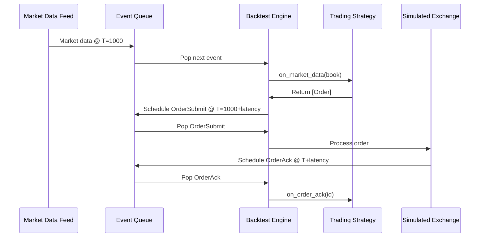

## Overview

NanoARB uses an event-driven architecture for both backtesting and live trading. All market data updates, order lifecycle events, and timer callbacks flow through a priority queue ordered by timestamp, ensuring deterministic replay and accurate latency simulation.

## Event Types

Defined in `nano-backtest/src/events.rs:11`:

```rust
pub enum EventType {
    /// Market data update received
    MarketData { instrument_id: u32 },
    
    /// Order submitted to exchange
    OrderSubmit { order: Order },
    
    /// Order acknowledged by exchange
    OrderAck { order_id: OrderId },
    
    /// Order rejected by exchange
    OrderReject { order_id: OrderId, reason: String },
    
    /// Order filled (partial or complete)
    OrderFill { fill: Fill },
    
    /// Order cancelled
    OrderCancel { order_id: OrderId },
    
    /// Cancel rejected
    CancelReject { order_id: OrderId, reason: String },
    
    /// Timer event for scheduled actions
    Timer { timer_id: u64, data: Option<String> },
    
    /// Signal from strategy
    Signal { name: String, value: f64 },
    
    /// End of data
    EndOfData,
}
```

## Event Structure

From `nano-backtest/src/events.rs:79`:

```rust
pub struct Event {
    /// Event timestamp (when it occurs)
    pub timestamp: Timestamp,
    
    /// Sequence number for ordering events at same timestamp
    pub sequence: u64,
    
    /// Event type and data
    pub event_type: EventType,
}
```

The `sequence` field ensures deterministic ordering when multiple events occur at the exact same nanosecond:

```rust
impl Ord for Event {
    fn cmp(&self, other: &Self) -> Ordering {
        // Reverse ordering for min-heap behavior
        match other.timestamp.as_nanos().cmp(&self.timestamp.as_nanos()) {
            Ordering::Equal => other.sequence.cmp(&self.sequence),
            ord => ord,
        }
    }
}
```

## Event Queue

Implemented as a binary min-heap in `nano-backtest/src/events.rs:187`:

```rust
pub struct EventQueue {
    /// Internal heap storage
    heap: BinaryHeap<Event>,
    /// Sequence counter for tie-breaking
    sequence_counter: u64,
}

impl EventQueue {
    /// Push an event with auto-generated sequence number
    pub fn push(&mut self, timestamp: Timestamp, event_type: EventType) {
        self.sequence_counter += 1;
        self.heap.push(Event::new(
            timestamp,
            self.sequence_counter,
            event_type,
        ));
    }
    
    /// Pop the next event (earliest timestamp)
    pub fn pop(&mut self) -> Option<Event> {
        self.heap.pop()
    }
    
    /// Peek at next event without removing
    pub fn peek(&self) -> Option<&Event> {
        self.heap.peek()
    }
}
```

### Queue Complexity

- **Push**: O(log n)
- **Pop**: O(log n)  
- **Peek**: O(1)
- **Memory**: O(n) where n = pending events

## Event Flow



## Scheduling Events

The event queue provides helper methods:

```rust
let mut queue = EventQueue::new();

// Schedule market data
queue.schedule_market_data(
    Timestamp::from_nanos(1_000_000),
    instrument_id,
);

// Schedule order submission
queue.schedule_order_submit(
    Timestamp::from_nanos(1_001_000),
    order,
);

// Schedule fill
queue.schedule_fill(
    Timestamp::from_nanos(1_002_000),
    fill,
);

// Schedule timer callback
queue.schedule_timer(
    Timestamp::from_nanos(2_000_000),
    timer_id,
    Some("rebalance".to_string()),
);
```

## Latency Simulation

Implemented in `nano-backtest/src/latency.rs:54`:

```rust
pub struct LatencySimulator {
    /// Base order latency in nanoseconds
    order_latency_ns: i64,
    /// Base market data latency in nanoseconds  
    market_data_latency_ns: i64,
    /// Base acknowledgment latency in nanoseconds
    ack_latency_ns: i64,
    /// Jitter model
    jitter_model: JitterModel,
    /// Random number generator
    rng: StdRng,
}
```

### Jitter Models

From `nano-backtest/src/latency.rs:26`:

```rust
pub enum JitterModel {
    /// No jitter (deterministic)
    None,
    
    /// Uniform jitter around base latency
    Uniform { max_jitter_ns: i64 },
    
    /// Normal distribution jitter
    Normal { std_dev_ns: f64 },
    
    /// Log-normal distribution (realistic for network latency)
    LogNormal { mu: f64, sigma: f64 },
    
    /// Empirical distribution from historical data
    Empirical { percentiles: [i64; 5] },
}
```

### Latency Calculation

```rust
impl LatencySimulator {
    /// Calculate order arrival time at exchange
    pub fn order_arrival_time(&mut self, submit_time: Timestamp) -> Timestamp {
        let latency = (self.order_latency_ns + self.get_jitter()).max(0);
        submit_time.add_nanos(latency)
    }
    
    /// Calculate market data reception time
    pub fn market_data_reception_time(
        &mut self,
        exchange_time: Timestamp,
    ) -> Timestamp {
        let latency = (self.market_data_latency_ns + self.get_jitter()).max(0);
        exchange_time.add_nanos(latency)
    }
    
    /// Calculate order acknowledgment reception time
    pub fn ack_reception_time(&mut self, exchange_ack_time: Timestamp) -> Timestamp {
        let latency = (self.ack_latency_ns + self.get_jitter()).max(0);
        exchange_ack_time.add_nanos(latency)
    }
}
```

### Colo Latency Models

Pre-configured for common colo facilities:

```rust
use nano_backtest::latency::ColoLatencyModel;

// CME Aurora (primary datacenter)
let aurora = ColoLatencyModel::aurora();
assert_eq!(aurora.order_latency(), 5_000); // 5 microseconds

// NY5 (generic NY colo)
let ny5 = ColoLatencyModel::ny5();
assert_eq!(ny5.order_latency(), 50_000); // 50 microseconds

// Custom colo
let custom = ColoLatencyModel::new(
    10_000,  // 10us to exchange
    3_000,   // 3us exchange processing
);

let rtt = custom.round_trip_estimate();
assert_eq!(rtt, 23_000); // 23 microseconds RTT
```

## Event Processing Loop

From `nano-backtest/src/engine.rs:118`:

```rust
pub fn process_event<S: Strategy>(&mut self, event: Event, strategy: &mut S) {
    self.current_time = event.timestamp;
    self.events_processed += 1;
    
    match &event.event_type {
        EventType::MarketData { instrument_id } => {
            self.on_market_data(*instrument_id, strategy);
        }
        EventType::OrderSubmit { order } => {
            self.on_order_submit(*order);
        }
        EventType::OrderAck { order_id } => {
            strategy.on_order_ack(*order_id);
        }
        EventType::OrderFill { fill } => {
            self.on_fill(*fill, strategy);
        }
        EventType::OrderCancel { order_id } => {
            strategy.on_order_cancel(*order_id);
        }
        EventType::OrderReject { order_id, reason } => {
            strategy.on_order_reject(*order_id, reason);
        }
        EventType::Timer { timer_id, data } => {
            self.on_timer(*timer_id, data.as_deref());
        }
        EventType::Signal { name, value } => {
            self.on_signal(name, *value);
        }
        EventType::EndOfData => {
            self.state = EngineState::Completed;
        }
    }
}
```

## Timing Considerations

### Market Data Timestamps

Market data has multiple timestamps:

```rust
// Exchange timestamp (when event occurred on exchange)
let exchange_time = book_update.transact_time;

// Gateway timestamp (when we received it)
let gateway_time = exchange_time + market_data_latency;

// Strategy timestamp (when strategy processes it)
let strategy_time = gateway_time;
```

### Order Timestamps

```rust
// Strategy decision time
let decision_time = Timestamp::now();

// Order submission time (includes serialization)
let submit_time = decision_time + serialization_latency;

// Exchange arrival time
let arrival_time = submit_time + network_latency;

// Acknowledgment time
let ack_time = arrival_time + exchange_processing;

// Ack reception time
let recv_time = ack_time + network_latency;

// Total latency
let total_latency = recv_time - decision_time;
```

### Fill Timestamps

```rust
pub struct Fill {
    pub order_id: OrderId,
    pub price: Price,
    pub quantity: Quantity,
    pub side: Side,
    pub is_maker: bool,
    pub timestamp: Timestamp,  // Exchange fill time
    pub fee: f64,
}

// Strategy receives fill notification later:
let notification_time = fill.timestamp + ack_latency;
```

## Event Ordering Example

```rust
let mut queue = EventQueue::new();

// Events arrive out of order
queue.push(Timestamp::from_nanos(100), EventType::EndOfData);
queue.push(Timestamp::from_nanos(50), EventType::MarketData { instrument_id: 1 });
queue.push(Timestamp::from_nanos(75), EventType::MarketData { instrument_id: 1 });

// But are processed in timestamp order
assert_eq!(queue.pop().unwrap().timestamp.as_nanos(), 50);
assert_eq!(queue.pop().unwrap().timestamp.as_nanos(), 75);
assert_eq!(queue.pop().unwrap().timestamp.as_nanos(), 100);
```

## Same Timestamp Ordering

When events occur at the same nanosecond, sequence numbers determine order:

```rust
let mut queue = EventQueue::new();
let t = Timestamp::from_nanos(100);

// All at same timestamp
queue.push(t, EventType::MarketData { instrument_id: 1 });
queue.push(t, EventType::OrderSubmit { order });
queue.push(t, EventType::Timer { timer_id: 1, data: None });

// Processed in submission order (sequence 1, 2, 3)
let e1 = queue.pop().unwrap();
assert!(e1.is_market_data());

let e2 = queue.pop().unwrap();
assert!(matches!(e2.event_type, EventType::OrderSubmit { .. }));

let e3 = queue.pop().unwrap();
assert!(matches!(e3.event_type, EventType::Timer { .. }));
```

## Performance Characteristics

### Event Processing Rate

- **Typical**: 1-5 million events/second
- **With complex strategies**: 500K-1M events/second
- **Bottleneck**: Strategy logic, not event queue

### Memory Usage

- Each `Event`: ~64 bytes
- 1M pending events: ~64 MB
- Queue pre-allocates capacity to avoid reallocations

### Latency Distribution

Typical HFT latencies:

```rust
let config = LatencyConfig {
    order_latency_ns: 10_000,        // 10 microseconds
    market_data_latency_ns: 5_000,   // 5 microseconds
    ack_latency_ns: 15_000,          // 15 microseconds
    jitter_ns: 2_000,                // +/- 2 microseconds
    use_random_jitter: true,
};

// Results in:
// P50: 10us, P95: 14us, P99: 16us order latency
```

## Best Practices

1. **Always use event queue** - Don't process events directly
2. **Include latency simulation** - Realistic backtests require realistic latency
3. **Pre-allocate capacity** - Avoid reallocations during backtest
4. **Use sequence numbers** - Ensure deterministic ordering
5. **Timestamp everything** - Critical for analysis and debugging

## Debugging Events

```rust
impl Event {
    /// Check event type
    pub fn is_market_data(&self) -> bool {
        matches!(self.event_type, EventType::MarketData { .. })
    }
    
    pub fn is_order_event(&self) -> bool {
        matches!(
            self.event_type,
            EventType::OrderSubmit { .. }
                | EventType::OrderAck { .. }
                | EventType::OrderFill { .. }
                | EventType::OrderCancel { .. }
                | EventType::OrderReject { .. }
        )
    }
}

// Log events for debugging
for event in events {
    tracing::debug!(
        "Event @ {}ns (seq={}): {:?}",
        event.timestamp.as_nanos(),
        event.sequence,
        event.event_type,
    );
}
```

## Related Topics

- [Order Books](/concepts/order-books) - Market data events update order books
- [Strategies](/concepts/strategies) - Strategies respond to events
- [Price Types](/concepts/price-types) - Timestamp type for event ordering