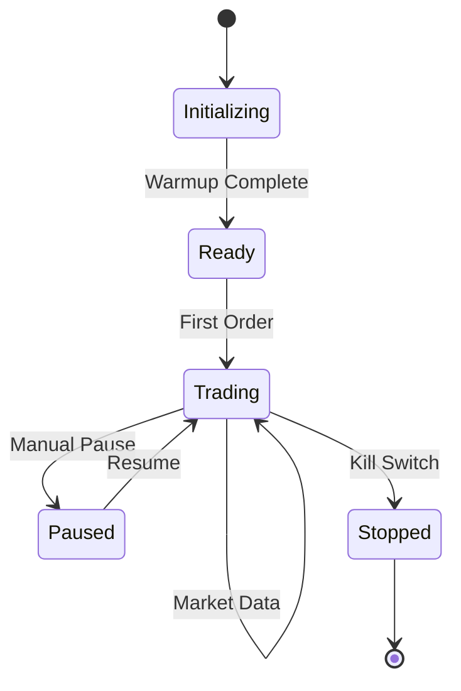

## Overview

NanoARB uses a trait-based strategy system that separates trading logic from execution infrastructure. All strategies implement the `Strategy` trait, enabling hot-swapping, backtesting, and consistent interfaces across different trading approaches.

## Strategy Trait

Defined in `nano-core/src/traits.rs:48`:

```rust
pub trait Strategy: Send + Sync {
    /// Strategy name for logging and metrics
    fn name(&self) -> &str;
    
    /// Called on each market data update
    fn on_market_data(&mut self, book: &dyn OrderBook) -> Vec<Order>;
    
    /// Called when an order is filled
    fn on_fill(&mut self, fill: &Fill);
    
    /// Called when an order is acknowledged
    fn on_order_ack(&mut self, order_id: OrderId);
    
    /// Called when an order is rejected
    fn on_order_reject(&mut self, order_id: OrderId, reason: &str);
    
    /// Called when an order is cancelled
    fn on_order_cancel(&mut self, order_id: OrderId);
    
    /// Get current position
    fn position(&self) -> i64;
    
    /// Get current P&L
    fn pnl(&self) -> f64;
    
    /// Check if strategy is ready to trade
    fn is_ready(&self) -> bool;
    
    /// Reset strategy state
    fn reset(&mut self);
}
```

## Strategy Lifecycle



Implemented in `nano-strategy/src/base.rs:8`:

```rust
pub enum StrategyState {
    Initializing,  // Warming up, building history
    Ready,         // Ready to trade
    Trading,       // Actively trading
    Paused,        // Temporarily paused
    Stopped,       // Permanently stopped
    Error,         // Error state
}
```

## Base Strategy

All strategies should build on `BaseStrategy` which handles common functionality:

```rust
use nano_strategy::base::BaseStrategy;

let mut base = BaseStrategy::new("my_strategy", 12.5);

// Automatically tracks:
// - Position (long/short/flat)
// - Realized P&L
// - Unrealized P&L  
// - Fill count
// - Round trips
// - Average entry price
```

### Position Tracking

From `nano-strategy/src/base.rs:80`:

```rust
pub fn update_position(&mut self, fill: &Fill) {
    let fill_qty = i64::from(fill.quantity.value());
    let signed_qty = if fill.side == Side::Buy {
        fill_qty
    } else {
        -fill_qty
    };
    
    // Check if adding to or reducing position
    let same_direction = 
        (self.position >= 0 && signed_qty > 0) || 
        (self.position <= 0 && signed_qty < 0);
    
    if same_direction || self.position == 0 {
        // Adding to position - update average entry
        let old_notional = self.position.abs() * self.avg_entry_price;
        let new_notional = fill_qty * fill.price.raw();
        let new_total_qty = self.position.abs() + fill_qty;
        
        if new_total_qty > 0 {
            self.avg_entry_price = (old_notional + new_notional) / new_total_qty;
        }
        self.position += signed_qty;
    } else {
        // Reducing position - realize P&L
        let reduce_qty = fill_qty.min(self.position.abs());
        let price_diff = if self.position > 0 {
            fill.price.raw() - self.avg_entry_price
        } else {
            self.avg_entry_price - fill.price.raw()
        };
        
        let pnl_ticks = price_diff * reduce_qty;
        self.realized_pnl += pnl_ticks as f64 * self.tick_value / 100.0;
        
        self.position += signed_qty;
        
        // Check for round trip completion
        if self.position == 0 {
            self.round_trips += 1;
        }
    }
}
```

## Market Making Strategy

Provides liquidity by quoting both sides of the market. Implemented in `nano-strategy/src/market_maker.rs:167`:

```rust
use nano_strategy::market_maker::{MarketMakerStrategy, MarketMakerConfig};

let config = MarketMakerConfig {
    base_spread_ticks: 2,           // 2 tick spread
    inventory_skew_factor: 0.5,     // Skew quotes based on inventory
    max_inventory: 50,              // Max position
    order_size: 5,                  // Contracts per level
    num_levels: 3,                  // Quote 3 levels deep
    min_edge_ticks: 1,             // Minimum profit per fill
    cancel_distance_ticks: 10,     // Cancel if 10 ticks from BBO
    tick_size: 25,                 // Tick size
    refresh_interval_ns: 100_000_000, // Refresh every 100ms
};

let mut strategy = MarketMakerStrategy::new(
    "mm_strategy",
    instrument_id,
    config,
    12.5, // tick value
);
```

### Inventory Skewing

From `nano-strategy/src/market_maker.rs:197`:

```rust
fn calculate_quotes(&self, mid: Price) -> (Price, Price) {
    let position = self.base.position();
    let max_inv = self.config.max_inventory as f64;
    
    // Calculate inventory skew (-1 to +1)
    let inv_ratio = if max_inv > 0.0 {
        (position as f64 / max_inv).clamp(-1.0, 1.0)
    } else {
        0.0
    };
    
    // Skew quotes to reduce inventory
    // Positive inventory -> lower bid, higher ask
    let skew_ticks = (inv_ratio 
        * self.config.inventory_skew_factor 
        * self.config.base_spread_ticks as f64) as i64;
    
    let half_spread = self.config.base_spread_ticks * self.config.tick_size / 2;
    
    let bid_price = Price::from_raw(
        mid.raw() - half_spread - skew_ticks * self.config.tick_size
    );
    let ask_price = Price::from_raw(
        mid.raw() + half_spread - skew_ticks * self.config.tick_size
    );
    
    (bid_price, ask_price)
}
```

### Quote Management

Tracks active orders on both sides:

```rust
let quotes = strategy.quotes();

// Get all active bid orders
let bid_ids = quotes.bid_order_ids();

// Get total quoted quantity
let total_bid_qty = quotes.total_bid_quantity();
let total_ask_qty = quotes.total_ask_quantity();

// Check if orders are pending ack
if quotes.has_pending_acks() {
    // Wait before sending more orders
}
```

## Signal-Based Strategy

Trades based on ML model predictions or technical signals. Implemented in `nano-strategy/src/signals.rs:114`:

```rust
use nano_strategy::signals::{SignalStrategy, SignalConfig, Signal};

let config = SignalConfig {
    min_confidence: 0.55,      // Minimum confidence threshold
    min_magnitude: 0.001,      // Minimum signal strength
    confidence_scaling: true,  // Scale size by confidence
    max_position_size: 1.0,    // Max position as fraction
    target_ticks: 10,         // Profit target
    stop_ticks: 5,            // Stop loss
};

let mut strategy = SignalStrategy::new(
    "ml_signal",
    instrument_id,
    config,
    10,    // base order size
    50,    // max position
    12.5,  // tick value
);
```

### Processing Signals

From `nano-strategy/src/signals.rs:158`:

```rust
pub fn process_signal(&mut self, signal: &Signal, book: &dyn OrderBook) -> Vec<Order> {
    let mut orders = Vec::new();
    
    // Don't trade if we have a pending order
    if self.pending_order.is_some() {
        return orders;
    }
    
    // Check signal confidence
    if signal.confidence < self.config.min_confidence {
        return orders;
    }
    
    // Get trading side from signal
    let side = match signal.side() {
        Some(s) => s,
        None => return orders, // Neutral signal
    };
    
    // Calculate order size based on confidence
    let order_qty = self.calculate_order_size(signal, self.base.position());
    
    if order_qty == 0 {
        return orders;
    }
    
    // Create order at best price
    let order_price = match side {
        Side::Buy => book.best_bid().map_or(mid, |(p, _)| p),
        Side::Sell => book.best_ask().map_or(mid, |(p, _)| p),
    };
    
    let order = Order::new_limit(
        order_id,
        self.instrument_id,
        side,
        order_price,
        Quantity::new(order_qty),
        TimeInForce::IOC, // Immediate or cancel
    );
    
    orders.push(order);
    orders
}
```

### Signal Types

```rust
use nano_strategy::signals::Signal;
use nano_core::types::Timestamp;

// Buy signal
let buy = Signal::buy(
    0.8,              // strength (0-1)
    0.75,             // confidence (0-1)
    Timestamp::now()
);

// Sell signal
let sell = Signal::sell(0.7, 0.65, Timestamp::now());

// Neutral (no trade)
let neutral = Signal::neutral(Timestamp::now());

// Check signal properties
assert!(buy.is_buy());
assert_eq!(buy.side(), Some(Side::Buy));
assert_eq!(buy.direction, 1);
```

## Reinforcement Learning Strategy

Uses RL agents for adaptive trading. Basic structure:

```rust
use nano_strategy::rl_env::RLStrategy;

let mut strategy = RLStrategy::new(
    "rl_agent",
    instrument_id,
    model_path,
    rl_config,
);

// Strategy observes market state and selects actions
// Actions: {buy, sell, hold} × {size}
// Rewards: P&L, Sharpe ratio, or custom metric
```

## Custom Strategy Example

```rust
use nano_core::traits::{OrderBook, Strategy};
use nano_core::types::{Order, Fill, OrderId, Side, Quantity, TimeInForce};
use nano_strategy::base::BaseStrategy;

pub struct MomentumStrategy {
    base: BaseStrategy,
    instrument_id: u32,
    lookback_window: Vec<Price>,
    threshold: f64,
}

impl MomentumStrategy {
    pub fn new(name: &str, instrument_id: u32, threshold: f64) -> Self {
        Self {
            base: BaseStrategy::new(name, 12.5),
            instrument_id,
            lookback_window: Vec::with_capacity(100),
            threshold,
        }
    }
    
    fn calculate_momentum(&self) -> f64 {
        if self.lookback_window.len() < 2 {
            return 0.0;
        }
        
        let first = self.lookback_window.first().unwrap().raw();
        let last = self.lookback_window.last().unwrap().raw();
        
        (last - first) as f64 / first as f64
    }
}

impl Strategy for MomentumStrategy {
    fn name(&self) -> &str {
        self.base.name()
    }
    
    fn on_market_data(&mut self, book: &dyn OrderBook) -> Vec<Order> {
        self.base.on_market_data(book);
        
        // Update price history
        if let Some(mid) = book.mid_price() {
            self.lookback_window.push(mid);
            if self.lookback_window.len() > 100 {
                self.lookback_window.remove(0);
            }
        }
        
        let momentum = self.calculate_momentum();
        
        // Generate signal
        if momentum > self.threshold && self.base.is_flat() {
            // Strong upward momentum - buy
            vec![Order::new_market(
                OrderId::new(1),
                self.instrument_id,
                Side::Buy,
                Quantity::new(10),
            )]
        } else if momentum < -self.threshold && self.base.is_flat() {
            // Strong downward momentum - sell
            vec![Order::new_market(
                OrderId::new(1),
                self.instrument_id,
                Side::Sell,
                Quantity::new(10),
            )]
        } else {
            Vec::new()
        }
    }
    
    fn on_fill(&mut self, fill: &Fill) {
        self.base.on_fill(fill);
    }
    
    fn on_order_ack(&mut self, order_id: OrderId) {}
    fn on_order_reject(&mut self, _: OrderId, _: &str) {}
    fn on_order_cancel(&mut self, _: OrderId) {}
    
    fn position(&self) -> i64 {
        self.base.position()
    }
    
    fn pnl(&self) -> f64 {
        self.base.pnl()
    }
    
    fn is_ready(&self) -> bool {
        self.lookback_window.len() >= 100
    }
    
    fn reset(&mut self) {
        self.base.reset();
        self.lookback_window.clear();
    }
}
```

## Strategy Composition

Combine multiple strategies:

```rust
pub struct MultiStrategy {
    strategies: Vec<Box<dyn Strategy>>,
    weights: Vec<f64>,
}

impl Strategy for MultiStrategy {
    fn on_market_data(&mut self, book: &dyn OrderBook) -> Vec<Order> {
        let mut all_orders = Vec::new();
        
        for strategy in &mut self.strategies {
            let orders = strategy.on_market_data(book);
            all_orders.extend(orders);
        }
        
        // Could aggregate, filter, or modify orders here
        all_orders
    }
    
    fn position(&self) -> i64 {
        self.strategies.iter().map(|s| s.position()).sum()
    }
    
    // ... other methods
}
```

## Best Practices

1. **Always use BaseStrategy** for common functionality
2. **Keep state minimal** - strategies should be lightweight
3. **Return orders, don't execute** - separation of concerns
4. **Check is_ready()** before trading
5. **Handle all callbacks** even if no-op
6. **Test in backtest first** before live trading

## Related Topics

- [Order Books](/concepts/order-books) - Market data input to strategies
- [Event-Driven Architecture](/concepts/event-driven) - How strategies receive events
- [Price Types](/concepts/price-types) - Working with prices in strategy logic