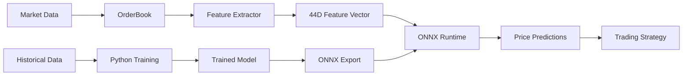

NanoARB integrates state-of-the-art machine learning for price prediction using a Mamba-based sequence model optimized for sub-microsecond inference latency.

## Architecture Overview

The ML pipeline consists of three components:

1. **Feature Extraction** (Rust): Extract LOB features in real-time
2. **Model Training** (Python): Train Mamba-LOB model on historical data
3. **Inference** (Rust + ONNX): Run predictions with &lt;1μs latency



## Mamba-LOB Model

Mamba-LOB uses selective state space models instead of attention for O(L) complexity and faster inference.

### Model Architecture

```python
class MambaLOBModel(nn.Module):
    def __init__(
        self,
        input_dim: int = 40,      # 10 levels × 4 features
        hidden_dim: int = 128,     # Hidden state dimension
        d_state: int = 16,         # SSM state dimension
        d_conv: int = 4,           # Convolution kernel size
        expand: int = 2,           # Expansion factor
        num_layers: int = 4,       # Number of Mamba blocks
        num_horizons: int = 3,     # Prediction horizons
        num_classes: int = 3,      # down/neutral/up
        dropout: float = 0.1,
    ):
        self.input_proj = nn.Linear(input_dim, hidden_dim)
        self.layers = nn.ModuleList([
            MambaBlock(hidden_dim, d_state, d_conv, expand)
            for _ in range(num_layers)
        ])
        self.output_heads = nn.ModuleList([
            nn.Sequential(
                nn.Linear(hidden_dim, hidden_dim // 2),
                nn.GELU(),
                nn.Linear(hidden_dim // 2, num_classes),
            )
            for _ in range(num_horizons)
        ])
```

**Source:** `python/training/models/mamba_lob.py:152-205`

### Mamba Block

The core Mamba block uses selective state space models:

```python
class MambaBlock(nn.Module):
    def __init__(self, d_model: int, d_state: int = 16, d_conv: int = 4):
        self.in_proj = nn.Linear(d_model, d_inner * 2)  # Project and split
        self.conv1d = nn.Conv1d(d_inner, d_inner, kernel_size=d_conv)
        self.x_proj = nn.Linear(d_inner, dt_rank + d_state * 2)  # SSM params
        self.dt_proj = nn.Linear(dt_rank, d_inner)  # Time delta
        self.A_log = nn.Parameter(torch.log(torch.arange(1, d_state + 1)))
        self.D = nn.Parameter(torch.ones(d_inner))
        self.out_proj = nn.Linear(d_inner, d_model)
    
    def forward(self, x):
        # Input projection and gating
        x, z = self.in_proj(x).chunk(2, dim=-1)
        
        # Causal convolution
        x = self.conv1d(x.transpose(1, 2)).transpose(1, 2)
        x = F.silu(x)
        
        # Selective SSM
        y = self.ssm(x)
        
        # Gate and output
        return self.out_proj(y * F.silu(z))
```

**Source:** `python/training/models/mamba_lob.py:11-91`

### Why Mamba vs Transformer?

| Feature | Transformer | Mamba-LOB |
|---------|-------------|----------|
| **Complexity** | O(L²) | O(L) |
| **Inference latency** | ~5-10μs | &lt;1μs |
| **Parameters** | 500K-1M | ~300K |
| **Memory** | Higher | Lower |
| **Sequential processing** | Parallel | Sequential (optimized) |

Mamba achieves better latency through:
- Linear complexity selective scan
- No attention computation
- Efficient state updates
- Better hardware utilization

## Training Pipeline

### Data Preparation

Convert market data to ML training samples:

```python
import numpy as np
from nano_lob import OrderBook, LobFeatureExtractor

def create_training_samples(
    market_data: list,
    sequence_length: int = 100,
    prediction_horizons: list[int] = [10, 50, 100],  # ticks ahead
) -> tuple[np.ndarray, np.ndarray]:
    """
    Create training samples from market data.
    
    Args:
        market_data: List of BookUpdate messages
        sequence_length: Length of input sequence
        prediction_horizons: Prediction horizons in ticks
        
    Returns:
        X: (N, seq_len, 44) feature sequences
        y: (N, num_horizons) target labels (0=down, 1=neutral, 2=up)
    """
    extractor = LobFeatureExtractor.new()
    book = OrderBook.new(1)
    
    features_history = []
    
    # Extract features from each update
    for update in market_data:
        book.apply_book_update(update)
        features = extractor.to_array(book)  # [44]
        features_history.append(features)
    
    # Create sequences
    X, y = [], []
    
    for i in range(sequence_length, len(features_history) - max(prediction_horizons)):
        # Input sequence: [i-seq_len:i]
        seq = features_history[i-sequence_length:i]
        
        # Target: price change at each horizon
        current_price = features_history[i][0]  # microprice
        targets = []
        
        for horizon in prediction_horizons:
            future_price = features_history[i + horizon][0]
            price_change = future_price - current_price
            
            # Classify: 0=down, 1=neutral, 2=up
            if price_change < -0.25:  # -1 tick
                label = 0
            elif price_change > 0.25:  # +1 tick
                label = 2
            else:
                label = 1
            
            targets.append(label)
        
        X.append(seq)
        y.append(targets)
    
    return np.array(X), np.array(y)
```

### Training Script

Train the model using the provided training script:

```bash
cd python/training

# Train with default config
python train.py \
    --epochs 50 \
    --batch-size 256 \
    --lr 1e-4 \
    --device cuda \
    --output-dir checkpoints

# Train and export to ONNX
python train.py \
    --epochs 50 \
    --export-onnx \
    --benchmark
```

**Source:** `python/training/train.py:183-302`

### Training Configuration

```python
from config import Config

config = Config(
    data=DataConfig(
        sequence_length=100,
        num_levels=10,
        features_per_level=4,
        prediction_horizons=[10, 50, 100],  # 10, 50, 100 ticks ahead
    ),
    model=ModelConfig(
        hidden_dim=128,
        num_layers=4,
        d_state=16,
        d_conv=4,
        expand=2,
        dropout=0.1,
    ),
    training=TrainingConfig(
        batch_size=256,
        learning_rate=1e-4,
        weight_decay=1e-5,
        num_epochs=50,
    ),
)
```

### Transaction Cost-Aware Loss

The model uses a custom loss function that accounts for trading costs:

```python
class TransactionCostAwareLoss(nn.Module):
    def __init__(
        self,
        spread_penalty: float = 0.001,
        slippage_estimate: float = 0.0005,
    ):
        self.spread_penalty = spread_penalty
        self.slippage_estimate = slippage_estimate
    
    def forward(self, logits, targets, magnitudes=None):
        # Base cross entropy loss
        ce_loss = F.cross_entropy(logits, targets, reduction='none')
        
        # Penalize low-confidence predictions
        probs = F.softmax(logits, dim=-1)
        entropy = -(probs * torch.log(probs + 1e-8)).sum(dim=-1)
        cost_penalty = self.spread_penalty * entropy
        
        # Weight by price move magnitude
        if magnitudes is not None:
            ce_loss = ce_loss * (1 + magnitudes.abs())
        
        return ce_loss.mean() + cost_penalty.mean()
```

This encourages the model to:
- Only predict when confident (low entropy)
- Focus on larger price moves (higher PnL potential)
- Account for spread and slippage costs

**Source:** `python/training/models/mamba_lob.py:259-317`

## ONNX Export

### Export Trained Model

```python
from models.mamba_lob import export_to_onnx

# Load trained model
model = MambaLOBModel.load_from_checkpoint("checkpoints/best_model.pt")

# Export to ONNX
export_to_onnx(
    model,
    output_path="models/mamba_lob.onnx",
    sequence_length=100,
    opset_version=17,
)
```

**Export includes:**
- Dynamic batch size support
- Constant folding optimization
- FP16/FP32 precision options

**Source:** `python/training/models/mamba_lob.py:320-354`

### ONNX Optimization

Optimize the exported model:

```python
import onnx
from onnxruntime.transformers import optimizer

# Load model
model = onnx.load("mamba_lob.onnx")

# Optimize
optimized_model = optimizer.optimize_model(
    "mamba_lob.onnx",
    model_type='bert',  # Use BERT optimizer (similar architecture)
    num_heads=0,
    hidden_size=128,
    optimization_options={
        'enable_gelu_approximation': True,
        'enable_layer_norm_fusion': True,
    }
)

optimized_model.save_model_to_file("mamba_lob_optimized.onnx")
```

## Rust Inference

Run inference in production using ONNX Runtime (planned - not yet implemented):

```rust
use ort::{Session, SessionBuilder, Value};
use nano_lob::features::LobFeatureExtractor;

struct MlPredictor {
    session: Session,
    extractor: LobFeatureExtractor,
    sequence_buffer: VecDeque<[f64; 44]>,
    sequence_length: usize,
}

impl MlPredictor {
    fn new(model_path: &str, sequence_length: usize) -> Result<Self> {
        let session = SessionBuilder::new()?
            .with_intra_threads(1)?
            .with_model_from_file(model_path)?;
        
        Ok(Self {
            session,
            extractor: LobFeatureExtractor::new(),
            sequence_buffer: VecDeque::with_capacity(sequence_length),
            sequence_length,
        })
    }
    
    fn predict(&mut self, book: &OrderBook) -> Result<Prediction> {
        // Extract features
        let features = self.extractor.to_array(book);
        
        // Add to sequence buffer
        self.sequence_buffer.push_back(features);
        if self.sequence_buffer.len() > self.sequence_length {
            self.sequence_buffer.pop_front();
        }
        
        // Not enough data yet
        if self.sequence_buffer.len() < self.sequence_length {
            return Ok(Prediction::default());
        }
        
        // Convert to tensor: [1, seq_len, 44]
        let input_data: Vec<f64> = self.sequence_buffer
            .iter()
            .flat_map(|f| f.iter().copied())
            .collect();
        
        let shape = [1, self.sequence_length, 44];
        let input_tensor = Value::from_array(
            self.session.allocator(),
            &input_data,
            &shape,
        )?;
        
        // Run inference
        let outputs = self.session.run(vec![input_tensor])?;
        let logits = outputs[0].try_extract::<f64>()?;
        
        // Parse predictions: [1, num_horizons, 3]
        let predictions = self.parse_predictions(logits)?;
        
        Ok(predictions)
    }
    
    fn parse_predictions(&self, logits: &[f64]) -> Result<Prediction> {
        // logits shape: [1, 3, 3] -> [batch, horizons, classes]
        let mut horizons = Vec::new();
        
        for h in 0..3 {
            let offset = h * 3;
            let probs = softmax(&logits[offset..offset+3]);
            
            let class = probs
                .iter()
                .enumerate()
                .max_by(|(_, a), (_, b)| a.partial_cmp(b).unwrap())
                .map(|(idx, _)| idx)
                .unwrap();
            
            let confidence = probs[class];
            
            // Map class to direction: 0=down, 1=neutral, 2=up
            let direction = match class {
                0 => -1,  // down
                1 => 0,   // neutral
                2 => 1,   // up
                _ => 0,
            };
            
            horizons.push(HorizonPrediction {
                direction,
                confidence,
            });
        }
        
        Ok(Prediction { horizons })
    }
}

#[derive(Debug, Clone)]
struct Prediction {
    horizons: Vec<HorizonPrediction>,
}

#[derive(Debug, Clone)]
struct HorizonPrediction {
    direction: i8,      // -1, 0, or 1
    confidence: f64,    // 0.0 to 1.0
}
```

## Integration with Trading Strategy

```rust
use nano_strategy::{Strategy, Signal};

struct MlStrategy {
    predictor: MlPredictor,
    confidence_threshold: f64,
}

impl Strategy for MlStrategy {
    fn on_book_update(&mut self, book: &OrderBook) -> Option<Signal> {
        // Get prediction
        let prediction = self.predictor.predict(book).ok()?;
        
        // Use shortest horizon (most confident)
        let short_term = &prediction.horizons[0];
        
        // Only trade if confident
        if short_term.confidence < self.confidence_threshold {
            return None;
        }
        
        // Generate signal
        match short_term.direction {
            1 => Some(Signal::Long),   // Predict up -> buy
            -1 => Some(Signal::Short), // Predict down -> sell
            _ => None,                 // Neutral -> no action
        }
    }
}
```

## Performance Optimization

### Inference Latency

Target latencies:
- **Feature extraction**: &lt;1μs
- **ONNX inference**: &lt;1μs
- **Total prediction**: &lt;2μs

### Optimization Techniques

1. **Model quantization** (FP16):
   ```python
   model = model.half()  # Convert to FP16
   export_to_onnx(model, "model_fp16.onnx")
   ```

2. **Sequence buffer reuse**:
   - Keep features in circular buffer
   - Only extract new features, not entire sequence

3. **ONNX Runtime optimization**:
   ```rust
   SessionBuilder::new()
       .with_intra_threads(1)        // Single thread
       .with_optimization_level(GraphOptimizationLevel::All)
       .with_execution_mode(ExecutionMode::Sequential)
   ```

4. **Batch inference** (if latency allows):
   - Accumulate N predictions
   - Run batch inference
   - Trade latency for throughput

### Benchmarking

```bash
# Python training latency
cd python/training
python train.py --benchmark

# Outputs:
# Mean: 850,000 ns (0.85 ms)
# Median: 820,000 ns
# P95: 1,200,000 ns
# P99: 1,500,000 ns
```

## Model Versioning

Manage multiple model versions:

```rust
struct ModelRegistry {
    models: HashMap<String, MlPredictor>,
    active_model: String,
}

impl ModelRegistry {
    fn load_model(&mut self, name: &str, path: &str) -> Result<()> {
        let predictor = MlPredictor::new(path, 100)?;
        self.models.insert(name.to_string(), predictor);
        Ok(())
    }
    
    fn switch_model(&mut self, name: &str) -> Result<()> {
        if !self.models.contains_key(name) {
            return Err(Error::ModelNotFound);
        }
        self.active_model = name.to_string();
        Ok(())
    }
    
    fn predict(&mut self, book: &OrderBook) -> Result<Prediction> {
        let predictor = self.models
            .get_mut(&self.active_model)
            .ok_or(Error::NoActiveModel)?;
        predictor.predict(book)
    }
}
```

## Model Monitoring

Track model performance in production:

```rust
struct ModelMetrics {
    predictions_total: u64,
    correct_predictions: u64,
    average_confidence: f64,
    latency_histogram: Histogram,
}

impl ModelMetrics {
    fn record_prediction(
        &mut self,
        prediction: &Prediction,
        actual: i8,
        latency_ns: u64,
    ) {
        self.predictions_total += 1;
        
        if prediction.horizons[0].direction == actual {
            self.correct_predictions += 1;
        }
        
        self.average_confidence = (
            self.average_confidence * (self.predictions_total - 1) as f64
            + prediction.horizons[0].confidence
        ) / self.predictions_total as f64;
        
        self.latency_histogram.record(latency_ns);
    }
    
    fn accuracy(&self) -> f64 {
        self.correct_predictions as f64 / self.predictions_total as f64
    }
}
```

## Next Steps

<CardGroup cols={2}>
<Card title="Feature Extraction" icon="chart-line" href="/data/feature-extraction">
  Learn about LOB feature engineering
</Card>

<Card title="Strategy Development" icon="chess" href="/strategies/strategy-trait">
  Build ML-powered strategies
</Card>

<Card title="Backtesting" icon="clock-rotate-left" href="/backtesting/configuration">
  Backtest ML strategies
</Card>

<Card title="Performance" icon="gauge-high" href="/deployment/production">
  Optimize inference latency
</Card>
</CardGroup>

## References

- [Mamba: Linear-Time Sequence Modeling with Selective State Spaces](https://arxiv.org/abs/2312.00752)
- [LOB-based Trading Strategies](https://papers.ssrn.com/sol3/papers.cfm?abstract_id=3380682)
- [ONNX Runtime Performance Tuning](https://onnxruntime.ai/docs/performance/tune-performance.html)